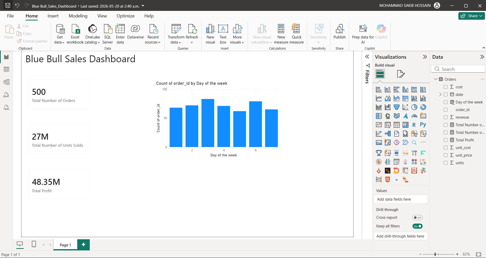

# 🐂 Blue Bull Sales Dashboard

> Power BI dashboard analysing high-volume energy drink sales with advanced DAX calculations for revenue, cost, and profit margin tracking across daily order data.


[← Back to Portfolio](../README.md)

---

## 📊 Dashboard preview



---

## 📌 Project summary

This dashboard tracks daily sales performance for **Blue Bull** — a fictional energy drink brand. The dataset covers high-volume daily orders from January to February 2024, with revenue figures in the hundreds of thousands per order. Advanced DAX measures were used to calculate dynamic profit margins, running totals, and unit price trends.

**Dataset covers:**
- 47+ daily orders from January to February 2024
- Units sold ranging from ~28,000 to ~127,000 per order
- Dynamic unit prices ($2.24 – $3.68) and unit costs ($0.77 – $1.57)
- Revenue and cost per order

---

## 🔍 Key insights

- **Daily revenue regularly exceeds $200,000** — with peak orders reaching over $392,000 in a single transaction.
- **Profit margins vary significantly by order** — ranging from ~40% to ~70% due to fluctuating unit prices and costs.
- **Order RB-00030 is the highest revenue order** — generating $392,586 from 127,463 units sold.
- **January shows higher order frequency than February** — suggesting stronger early-year demand or promotional activity.

---

## 🛠️ Tools used

| Tool | Purpose |
|---|---|
| Power BI Desktop | Report building, advanced DAX measures |
| DAX | Dynamic profit margin, running totals, min/max price measures |
| Microsoft Excel | Source data (Orders with units, revenue, cost) |
| Power Query | Data transformation and date table setup |

---

## 📁 Files

```
blue-bull-sales/
│
├── Blue_Bull_Sales_Dashboard.pbix     ← Power BI report
├── data/
│   └── blue_bull_practice.xlsx        ← Orders data
├── screenshots/
│   └── blue-bull-dashboard.png        ← Dashboard preview
└── README.md
```

---

## ▶️ How to view

1. Download `Blue_Bull_Sales_Dashboard.pbix`
2. Open it in [Power BI Desktop](https://powerbi.microsoft.com/desktop/) (free)
3. Data is embedded — no additional setup needed
