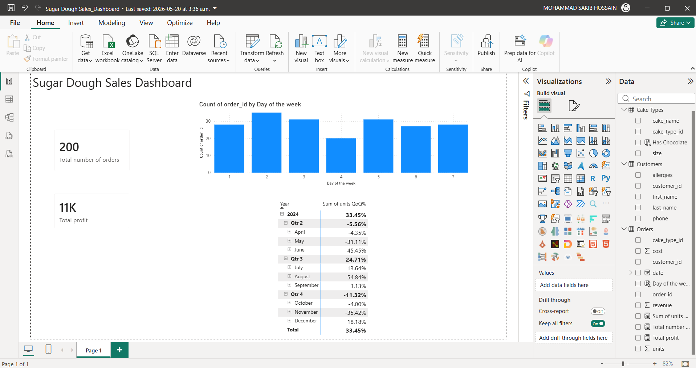

# 🎂 Sugar Dough Sales Dashboard

> Power BI dashboard analysing cake orders, customer behaviour, and revenue vs cost performance for a fictional bakery using advanced DAX calculations.


[← Back to Portfolio](../README.md)

---

## 📊 Dashboard preview



---

## 📌 Project summary

This dashboard tracks sales performance for **Sugar Dough** — a fictional bakery offering three cake types. The dataset spans orders from January to April 2024 across 10 customers, with advanced DAX measures used to calculate revenue, profit margins, and customer ordering patterns.

**Dataset covers:**
- 47+ orders from January to April 2024
- 10 customers with allergy information tracked
- 3 cake types: Red Velvet (9" Round), Chocolate Fudge (8" Round), Vanilla Bean (10" Round)
- Revenue and cost per order

---

## 🔍 Key insights

- **Customer 1 is the most frequent buyer** — placing the highest number of orders across all three cake types throughout the period.
- **Chocolate Fudge is the most ordered cake type** — appearing in the majority of orders, suggesting it is the most popular product.
- **Revenue consistently runs at roughly 2.5× cost** — indicating a healthy profit margin across all cake types.
- **Order frequency increases towards February and March** — suggesting a seasonal uptick likely tied to Valentine's Day and spring events.

---

## 🛠️ Tools used

| Tool | Purpose |
|---|---|
| Power BI Desktop | Report building, advanced DAX measures |
| DAX | Calculated columns, measures (e.g. total revenue, profit margin, YTD) |
| Microsoft Excel | Source data (Orders, Customers, Cake Types) |
| Power Query | Data transformation and table relationships |

---

## 📁 Files

```
sugar-dough-sales/
│
├── Sugar_Dough_Sales_Dashboard.pbix     ← Power BI report
├── data/
│   ├── sugar_dough_orders.xlsx          ← Orders data
│   ├── sugar_dough_customers.xlsx       ← Customer data
│   └── sugar_dough_cake_types.xlsx      ← Cake types reference
├── screenshots/
│   └── sugar-dough-dashboard.png        ← Dashboard preview
└── README.md
```

---

## ▶️ How to view

1. Download `Sugar_Dough_Sales_Dashboard.pbix`
2. Open it in [Power BI Desktop](https://powerbi.microsoft.com/desktop/) (free)
3. Data is embedded — no additional setup needed
