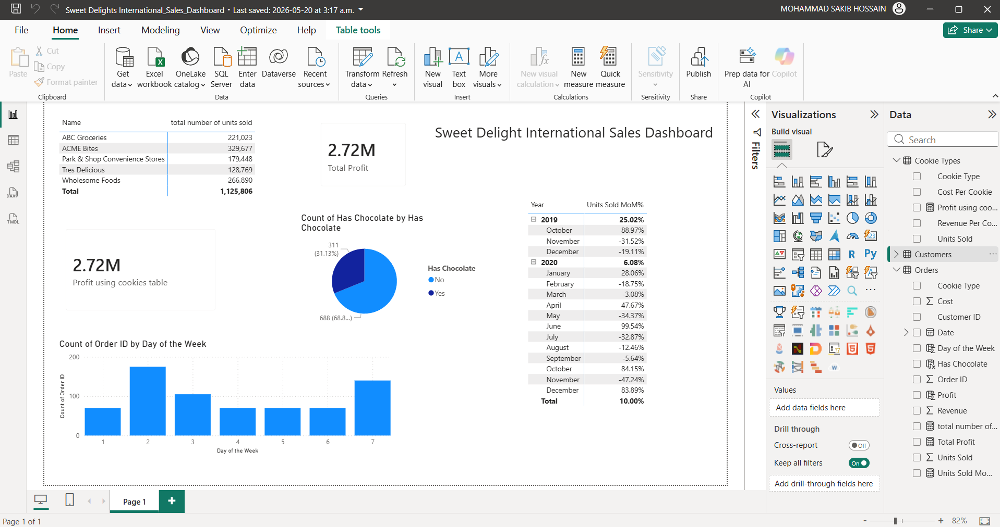

# 🍪 Sweet Delights International Sales Dashboard

> Power BI dashboard analysing international cookie sales across 5 business customers and 6 cookie types, with advanced DAX measures for revenue and profitability tracking.


[← Back to Portfolio](../README.md)

---

## 📊 Dashboard preview



---

## 📌 Project summary

This dashboard analyses cookie sales for **Sweet Delights International** — a fictional cookie manufacturer selling to 5 US-based business customers across multiple states. The dataset includes hundreds of orders across 6 cookie types, with advanced DAX calculations used for revenue analysis and customer performance comparison.

**Dataset covers:**
- 5 business customers across Seattle, Salt Lake City, Green Bay, Huntington, and Mobile
- 6 cookie types: Chocolate Chip, Fortune Cookie, Oatmeal Raisin, Snickerdoodle, Sugar, White Chocolate Macadamia Nut
- Revenue and cost per order
- Units sold per cookie type

---

## 🔍 Key insights

- **Chocolate Chip is the best-selling cookie** — with 338,239 total units sold, significantly ahead of all other types.
- **White Chocolate Macadamia Nut generates the highest revenue per cookie** at $6/unit, making it the most valuable product despite lower volume.
- **Customer 5 (Park & Shop Convenience Stores) places the largest individual orders** — frequently ordering 2,000–4,000+ units per transaction.
- **Fortune Cookie has the lowest revenue per unit ($1)** but also the lowest cost ($0.50), maintaining a consistent 50% profit margin.

---

## 🛠️ Tools used

| Tool | Purpose |
|---|---|
| Power BI Desktop | Report building, advanced DAX measures |
| DAX | Revenue totals, profit margin, customer ranking measures |
| Microsoft Excel | Source data (Orders, Customers, Cookie Types) |
| Power Query | Data transformation and table relationships |

---

## 📁 Files

```
sweet-delights-international-sales/
│
├── Sweet_Delights_International_Sales_Dashboard.pbix   ← Power BI report
├── data/
│   ├── sweet_delights_international_Orders.xlsx        ← Orders data
│   ├── sweet_delights_international_Customers.xlsx     ← Customer data
│   └── sweet_delights_international_Cookie-Types.xlsx  ← Cookie types reference
├── screenshots/
│   └── sweet-delights-dashboard.png                    ← Dashboard preview
└── README.md
```

---

## ▶️ How to view

1. Download `Sweet_Delights_International_Sales_Dashboard.pbix`
2. Open it in [Power BI Desktop](https://powerbi.microsoft.com/desktop/) (free)
3. Data is embedded — no additional setup needed
